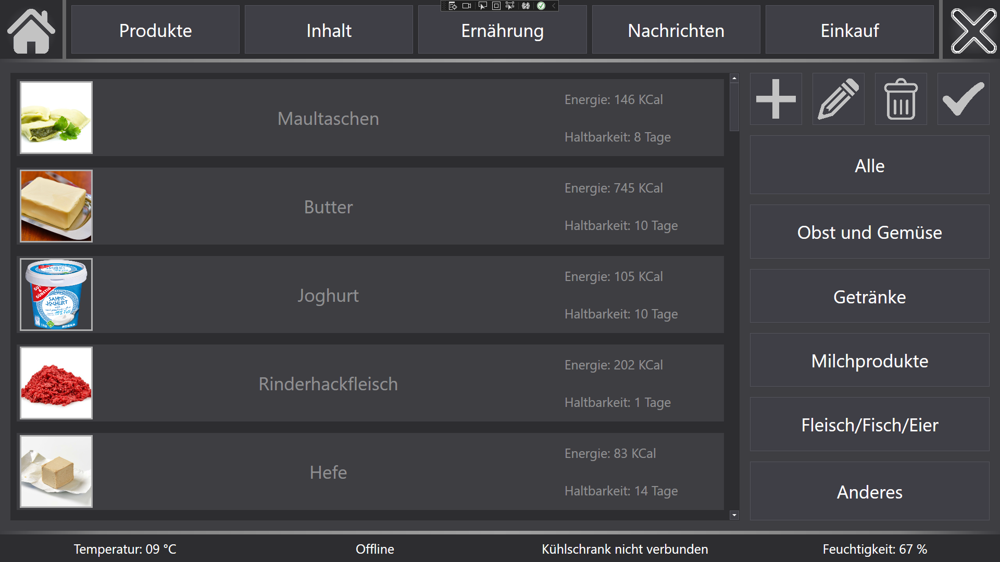

# Smart ReFITgerator - Mechatronic Project SS20

As part of my bachelor's degree, I was involved in a mechatronics project called "Smart ReFITgerator - a refrigerator for athletes".
Our team consisted of four mechatronics students for the software development and three business students for the elaboration of a marketing concept. Since I gained some experience in software development during my internship semester, I led the software development team.
Our software was connected to an AWS database, sent messages about expiring food via EMail, WhatsApp and SMS and used a digital scale to weigh the food when it was put into the fridge.
